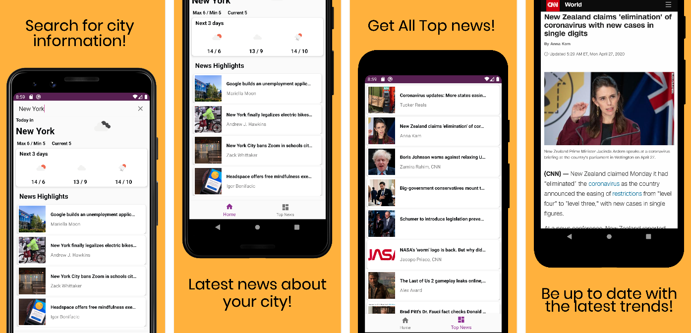

# Weather-and-News-Android

Developed an 100% Kotlin Android application for City search weather and news. The application is built on MVVM Architecture and Androidx librairies. Multiple API calls with Retrofit-Kotlin Coroutines, Okhttp and GSON parsing, LiveData, Koin Dependency Injection, Picasso, RecyclerView, Google’s Material Design, WebView, SharedPreferences, JetPack Navigation.

## Project characteristics 
-------
* [Kotlin](https://kotlinlang.org/)
* Architecture Design (Model-View-ViewModel)
* [Android Jetpack](https://developer.android.com/jetpack)
* [Navigation component](https://developer.android.com/guide/navigation/navigation-getting-started) Single-activity architecture
* [Dependency Injection- Koin](https://insert-koin.io/)
* [Google Material Design](https://material.io/design/)

## Built with
-------
* [Kotlin](https://kotlinlang.org) -Android mobile development has been Kotlin-first since Google I/O in 2019.
* [Coroutines](https://kotlinlang.org/docs/reference/coroutines-overview.html) - Asynchronous or non-blocking programming.
* [Android Architecture Components](https://developer.android.com/topic/libraries/architecture) MVVM stands for Model, View, ViewModel.
* [LiveData](https://developer.android.com/topic/libraries/architecture/livedata) - Data objects that notify views when the underlying data changes.
* [JetPack bottom Navigation Component](https://developer.android.com/jetpack) - Jetpack is a suite of libraries, tools, and guidance to help developers write high-quality apps more easily.
* [Room](https://developer.android.com/topic/libraries/architecture/room) - SQLite object mapping library.
* [Dependency Injection- Koin](https://insert-koin.io/) - Toothpick is a scope tree based, runtime with a special focus on Android.
* [DataBinding](https://developer.android.com/topic/libraries/data-binding) - The Data Binding Library is a support library that allows you to bind UI components in your layouts to data sources.
* [SharedPrferences](https://developer.android.com/reference/android/content/SharedPreferences) Interface for accessing and modifying preference data
* [Picasso](https://square.github.io/picasso/) A powerful image downloading and caching library for Android
* [GSON Converter](https://github.com/square/retrofit/tree/master/retrofit-converters/gson) A Converter which uses Gson for serialization to and from JSON.
* [Retrofit](https://square.github.io/retrofit/) A type-safe HTTP client for Android and Java.

## API Used
-------
* [OpenWeatherAPI](https://openweathermap.org/current) Access current weather data for any location on Earth including over 200,000 cities!
* [NewsOrg](http://newsapi.org/) Get breaking news headlines, and search for articles from over 50,000 news sources and blogs.
 
 
## Contact
If you need any help, you can connect with me.

Visit:- [https://harshithakv.com/](https://harshithakv.com/)
